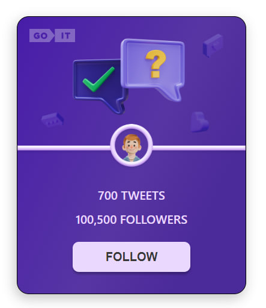

# Test

Цей проект було створено за допомогою
[Create React App](https://github.com/facebook/create-react-app). Для знайомства
та налаштування додаткових можливостей
[звернись до документації](https://facebook.github.io/create-react-app/docs/getting-started).

## Як виглядає проект

Проект - це картка одного твіту, яка виглядає таким чином

### Жива сторінка

Посилання на живу версію для цього рапозиторію
[https://NataliiaHrynchuk.github.io/Test](https://NataliiaHrynchuk.github.io/Test).

#### Як це працює

При клікові на кнопку Follow - її текст змінюється на Following. Також
змінюється колір кнопки. А до кількості фоловерів додається і ваш.

При оновлені сторінки фіксується кінцевий результат дій юзера.

При повторному клікові на кнопку її текст та колір змінюються до початкового
стану. Також змінюється і кількість фоловерів. Вона зменшується на 1.
